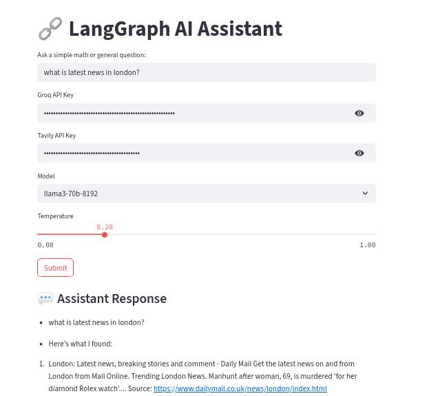

# LangGraph AI Assistant

An intelligent assistant built with FastAPI, Streamlit, LangGraph, and LangChain — supporting Groq’s LLaMA3 models and Tavily web search.

## Requirements

Before running the application, make sure you have the following software installed:

1. **Python**: Python 3.10.
2. Groq and tavily Api Keys

### Dependencies

This project relies on several Python libraries, which are listed in the `requirements.txt` file.

## Installation

1. **Clone the Repository**

   ```bash
   https://github.com/vamsi8106/Multi-Agent-Assistant.git
   cd langgraph_ai_assistant
2. **Create and Activate a Conda Environment**

   ```bash
   python3.10 -m venv .virtualenv
   ```
   ```bash
   source .virtualenv/bin/activate
3. **Install Dependencies**
   ```bash
   pip install -r requirements.txt     

4. **Run the Uvicorn in First Terminal**
  ```bash
  uvicorn app.main:app --reload --host 0.0.0.0 --port 8000
  ```
5. **Run the Streamlit App in Second Terminal**
  ```bash
  streamlit run app/streamlit_app.py
  ```
6. **Using Docker**
   ```bash
   docker build -t langgraph-assistant .
   ```
   ```bash
   docker run -lt  --name langgraph-container -p 8000:8000  -p 8501:8501  langgraph-assistante

   
🌐 Link can be accessed at

- FastAPI Docs: http://localhost:8000/docs

- Streamlit UI: http://localhost:8501
## The Interface looks like

  
